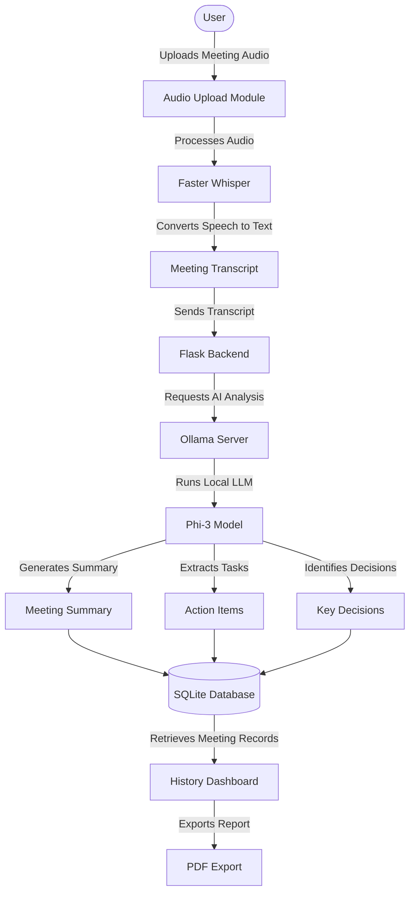

# 🤖 AI Meeting Assistant
### *Local-First AI Transcription & Meeting Intelligence Platform*

---

## 📌 Project Overview

AI Meeting Assistant is a privacy-focused meeting intelligence platform that automatically transcribes audio/video recordings and generates structured meeting summaries using locally running AI models.

The system combines:

- 🎙️ Faster Whisper for speech-to-text transcription
- 🧠 Ollama + Phi-3 for local LLM summarization
- 🐍 Flask for backend orchestration
- 🗄️ SQLite for meeting storage
- 🌐 HTMX + Jinja Templates for the frontend
- 📄 ReportLab for PDF report generation

All processing runs locally, eliminating cloud API costs while keeping meeting data private.

---

## ⚠️ Problem Statement & Objective

### The Problem

- Manual note-taking during meetings often misses important details.
- Reviewing long meeting recordings is time-consuming.
- Teams struggle to track action items and decisions.
- Meeting knowledge becomes difficult to search and retrieve later.

### The Objective

- Automatically transcribe meeting recordings.
- Generate structured AI-powered summaries.
- Store meetings in a searchable knowledge repository.
- Export professional meeting reports.
- Maintain complete privacy through local AI processing.

---

## ⚡ Core Features

### 🎙️ AI Transcription
- Upload audio or video recordings.
- Automatic speech-to-text conversion using Faster Whisper.
- Supports MP3, WAV, M4A, and MP4 files.

### 🧠 AI Meeting Summaries
Generate:
- Executive Summary
- Key Discussion Points
- Action Items
- Meeting Insights

### 🗄️ Meeting Repository
- Store transcripts and summaries.
- View meeting history.
- Open detailed meeting reports.

### 🔍 Search System
Search across:
- File names
- Meeting transcripts
- AI-generated summaries

### ✏️ Meeting Management
- View meeting details
- Update summaries
- Delete meetings

### 📄 PDF Export
Generate downloadable reports containing:
- Meeting metadata
- AI summary
- Full transcript

---

## 🛠️ Technologies Used

### Backend
- Python
- Flask
- SQLAlchemy

### Database
- SQLite

### AI Models

#### Speech Recognition
- Faster Whisper

#### Local LLM
- Ollama
- Phi-3

### Frontend
- HTML5
- CSS3
- HTMX
- Jinja2

### Reporting
- ReportLab

---

## 📐 System Architecture

The following diagram illustrates the complete workflow from meeting audio upload to AI-powered analysis and report generation:


---

## 🔄 Processing Flow

1. User uploads an audio/video recording.
2. Flask saves the uploaded file.
3. Faster Whisper converts speech into text.
4. Transcript is sent to Ollama.
5. Phi-3 generates a structured summary.
6. Transcript and summary are stored in SQLite.
7. User can:
   - View meeting details
   - Search meetings
   - Delete meetings
   - Export reports as PDF

---

## 📂 Project Structure

```text
ai-meet-assistant/
│
├── backend/
│   ├── app.py
│   ├── uploads/
│   ├── templates/
│   │   ├── index.html
│   │   ├── history.html
│   │   └── meeting_detail.html
│   │
│   ├── instance/
│   │   └── meetings.db
│   │
│   └── requirements.txt
│
├── README.md
└── .gitignore
```

---

## 🚀 Installation & Setup

### Clone Repository

```bash
git clone https://github.com/YOUR_USERNAME/ai-meet-assistant.git
cd ai-meet-assistant
```

### Create Virtual Environment

```bash
python -m venv venv
```

### Activate Environment

Windows:

```bash
venv\Scripts\activate
```

Linux/macOS:

```bash
source venv/bin/activate
```

### Install Dependencies

```bash
pip install -r requirements.txt
```

### Install Ollama

```bash
ollama pull phi3
```

### Run Application

```bash
python app.py
```

Open:

```text
http://127.0.0.1:5000
```

---

## 🌐 API Endpoints

| Method | Endpoint | Description |
|----------|-----------|-------------|
| POST | /upload | Upload meeting recording |
| GET | /meetings | Retrieve all meetings |
| GET | /meetings/<id> | Retrieve meeting by ID |
| PUT | /meetings/<id> | Update summary |
| DELETE | /meetings/<id> | Delete meeting |
| GET | /export/pdf/<id> | Export PDF report |

---

## 🧩 Challenges Faced & Solutions

### 1. Upload Folder Missing

**Issue**
- Uploaded files failed to save.

**Solution**

```python
os.makedirs(UPLOAD_FOLDER, exist_ok=True)
```

### 2. Database Schema Changes

**Issue**
```text
table meeting has no column named created_at
```

**Solution**
- Recreated database after schema updates.

### 3. Ollama Timeout Errors

**Issue**
- Large transcripts caused delayed responses.

**Solution**
- Added timeout handling.
- Added fallback summary messages.
- Reduced transcript size before summarization.

### 4. Search Filtering Issues

**Issue**
- Search bar returned no results.

**Solution**

```python
from sqlalchemy import or_
```

---

## 🏆 Current Achievements

- Complete CRUD Operations
- AI Transcription Pipeline
- Local LLM Summarization
- Searchable Meeting History
- Professional UI Dashboard
- PDF Report Export
- Local-First Architecture

---

## 📝 Future Roadmap

### 🎤 Speaker Diarization
Identify speakers automatically:

```text
Sarah:
Alex:
David:
```

Possible Tools:
- WhisperX
- PyAnnote

### ⚡ Background Processing
- Celery
- Redis
- Async job queues

### 🔎 Vector Search (RAG)

Ask questions such as:

```text
What did we discuss about onboarding?
```

Potential Technologies:
- ChromaDB
- FAISS
- Sentence Transformers

### 👤 Authentication
- User Login
- User Registration
- Personal Meeting Spaces

### ☁️ Deployment
- Docker
- Render
- Railway
- AWS

---

## 🎓 Learning Outcomes

- AI model orchestration with local LLMs
- Speech-to-text processing pipelines
- Flask backend development
- Database design and CRUD operations
- PDF document generation
- Frontend development with HTMX
- Local-first AI architecture

---

## 💼 Business Use Cases

- Team Meeting Documentation
- Client Call Summaries
- Interview Transcription
- Lecture Note Generation
- Project Retrospectives
- Internal Knowledge Management

---

## ✍️ Author

**Chaitanya**

Aspiring Software Engineer focused on AI, Backend Development, and Intelligent Automation Systems.

---

## 📜 License

MIT License

Feel free to use, modify, and extend this project for learning and development purposes.
